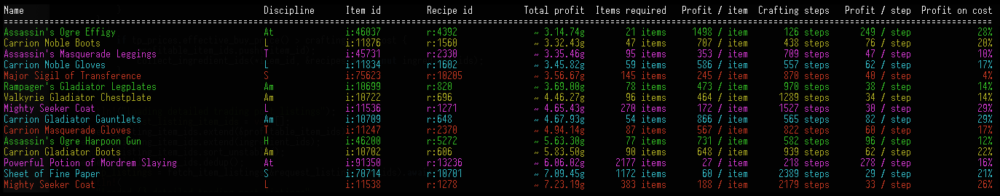
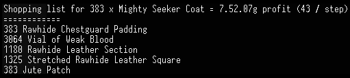

# gw2-arbitrage

Finds items in Guild Wars 2 that can be sold on the trading post for a higher price than the cost of crafting the item.

## Usage

1. Download the latest release for your platform from https://github.com/t-mw/gw2-arbitrage/releases and extract the zip contents.
1. If running Windows, open Command Prompt or PowerShell from the Start Menu. PowerShell is the better choice on Windows 7+. If running Linux or MacOS, open your terminal application.
1. Navigate to the extracted folder using the terminal application.
1. Run the `gw2-arbitrage` binary using the terminal application (i.e. on Windows run `gw2-arbitrage.exe` from PowerShell) to produce a list of items that can be crafted and immediately resold
for profit on the trading post using materials purchased from the trading post.
The prices used assume that you buy materials at the best offer and sell the crafted items at the best bid (accounting for liquidity - see [Effects of Low Liquidity](#effects-of-low-liquidity)), so the only time
spent waiting is during crafting.
Items with high 'profit / step' and 'profit on cost' values generally produce a higher return for the time invested.

    

1. Pass an item id as input (e.g. `gw2-arbitrage.exe 11538`) to print a shopping list for the item, which considers the total available liquidity for each ingredient on the trading post.
The shopping list will not include items that should be purchased from crafting station vendors. These are always cheaper to buy from the vendor instead of the trading post.

    

    By default the shopping list will assume that you want to produce as many copies of the item as can be profitably sold on the trading post.
    To limit the number of items that will be crafted a count may also be passed (e.g. `gw2-arbitrage.exe 11538 --count 100` will limit the shopping list to producing 100 items).

1. Detailed crafting instructions for the item can then be found on https://gw2efficiency.com/crafting/calculator/.
   To see prices that match the output of this tool select `sell price ("instant buy")` from the `Material price` dropdown, but be aware that the gw2efficiency calculator will not show accurate profits for large amounts of items due to the liquidity issue explained below.

**Important**: Check that you have the recipe for the item before spending any money. Some profitable opportunities listed by the tool exist because the recipes are difficult to obtain.

## Options

Run `gw2-arbitrage.exe --help` to see all available options, including CSV export.

## Effects of Low Liquidity

The shopping list may contain a mix of components (e.g. Trouser Padding) and raw materials required for that component (e.g. Bolts of Silk + Thread).
This is because the tool considers your effect on the market when you buy materials from the trading post.
For example, after buying enough Bolts of Silk and Thread to craft 100 x Trouser Padding, you may push the price of the materials high enough that it becomes cheaper to simply buy the Trouser Padding already crafted.
Similarly, the tool considers your effect on the market when you sell many items.
Although most existing tools ignore this effect, not accounting for it results in overestimating profits when crafting and selling large amounts of items.

## Cache

The first run of the tool can take a while since all items and recipes must be downloaded from the Guild Wars 2 API.
On subsequent runs the tool will use cached versions of the item and recipe databases, stored in the 'items.bin' and 'recipes.bin' files respectively.
These files can be deleted to clear the cache.
